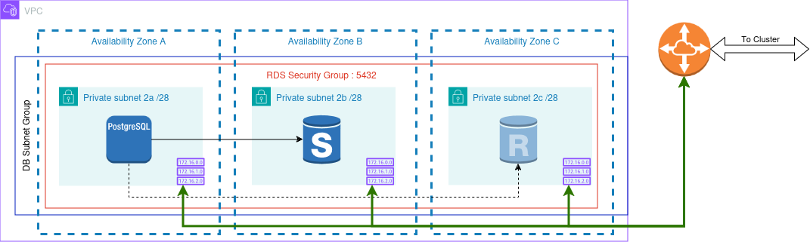

# RDS Base composition

The RDS base composition is designed to help build an RDS platform in (almost)
any configuration.

At present, only the following engines are supported by this composition

- mariadb
- mysql
- postgresql
- aurora-mariadb
- aurora-mysql
- aurora-postgresql

The composition can be deployed either inside of, or outside of cluster mode,
with and without auto-scaling (cluster mode only).

Using this composition it is possible to have non-cluster mode instances with
read-replicas and hot-standby.

> [!TIP]
> This composition requires various IDs to be provided to it in order to
> successfully operate.
>
> We recommend that you pair this with our [peeredvpcnetwork] composition for
> the best experience.

Secrets can be automatically synced to a secrets store of your choice using
[external-secrets-operator] and it is possible to provision inside the database
server or cluster using [provider-sql].

## Providers and functions

This composition relies on the following providers and functions:

### Providers

- [upbound/provider-aws-appautoscaling]
- [upbound/provider-aws-cloudwatchlogs]
- [upbound/provider-aws-ec2]
- [upbound/provider-aws-kms]
- [upbound/provder-aws-rds]
- [upbound/provider-aws-secretsmanager]
- [crossplane-contrib/provider-kubernetes]
- [crossplane-contrib/provider-sql]

### Functions

- [crossplane-contrib/function-kcl]
- [crossplane-contrib/function-auto-ready]

### External tools

- [external-secrets-operator]

## ESO Support

At the bare minimum `external-secrets-operator` must be installed to the same
cluster running crossplane. In each namespace you will store a crossplane claim,
you also need a secrets store for kubernetes secrets inside that namespace. The
name of this store must be `default`

### Example SecretStore config

For full configuration options, refer to the [eso kubernetes documentation].

```yaml
---
apiVersion: external-secrets.io/v1beta1
kind: SecretStore
metadata:
  name: default
  namespace: default
spec:
  provider:
    kubernetes:
      # with this, the store is able to
      # pull only from `default` namespace
      remoteNamespace: default
      server:
        caProvider:
          type: ConfigMap
          name: kube-root-ca.crt
          key: ca.crt
      auth:
        serviceAccount:
          name: "my-store"
```

### Enabling Managing secrets in SM

RDS allows secrets to be managed in Secrets Manager under certain circumstances
however not all configuration options support this capability.

With this in mind, the option has been disabled within this composition and
instead ESO can be used to push the secret to Secrets Manager on your behalf.

As a result of this, rotation capabilities are currently disabled.

### Connection Secrets

There is currently a difference between the connection secrets written by a
single instance, and those written in cluster-mode.

Instance based connection secrets are formatted using the standard properties

- username
- password

On the otherhand, connection secrets written by `cluster` resources are
formatted

- master_username
- attribute.master_password

This makes it difficult to use `provider-sql` with `cluster` resources as this
provider expects the former properties to be available in the connection secret.

To get around this, ESO is used to re-write the connection secret to a standard
format.

## Examples

The following examples are provided as part of this composition.

### Two read replicas



#### [examples/two-read-replicas](../examples/two-read-replicas.yaml)

Deploy a non-cluster RDS instance with two read replicas, one of which is a hot
standby node.

### MySQL Aurora cluster

### Postgresql Aurora cluster with autoscaling enabled

[external-secrets-operator]: https://external-secrets.io/
[eso kubernetes documentation]: https://external-secrets.io/latest/provider/kubernetes/
[upbound/provider-aws-appautoscaling]: https://marketplace.upbound.io/providers/upbound/provider-aws-appautoscaling
[upbound/provider-aws-cloudwatchlogs]: https://marketplace.upbound.io/providers/upbound/provider-aws-cloudwatchlogs
[upbound/provider-aws-ec2]: https://marketplace.upbound.io/providers/upbound/provider-aws-ec2
[upbound/provider-aws-kms]: https://marketplace.upbound.io/providers/upbound/provider-aws-kms
[upbound/provder-aws-rds]: https://marketplace.upbound.io/providers/upbound/provider-aws-rds
[upbound/provider-aws-secretsmanager]: https://marketplace.upbound.io/providers/upbound/provider-aws-secretsmanager
[crossplane-contrib/provider-kubernetes]: https://marketplace.upbound.io/providers/crossplane-contrib/provider-kubernetes
[crossplane-contrib/provider-sql]: https://marketplace.upbound.io/providers/crossplane-contrib/provider-sql
[crossplane-contrib/function-kcl]: https://marketplace.upbound.io/functions/crossplane-contrib/function-kcl
[crossplane-contrib/function-auto-ready]: https://marketplace.upbound.io/functions/crossplane-contrib/function-auto-ready
