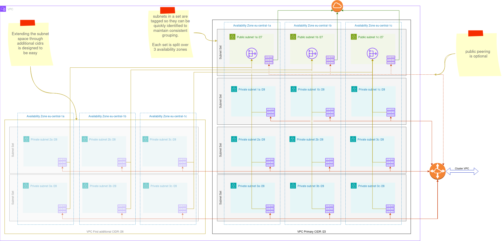
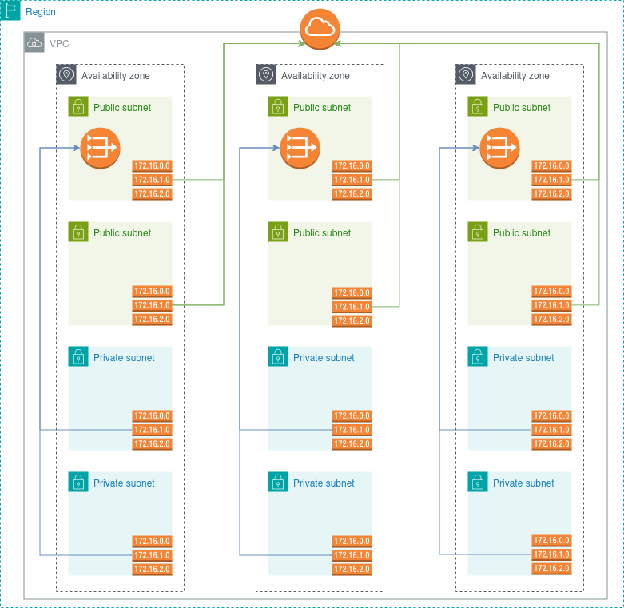
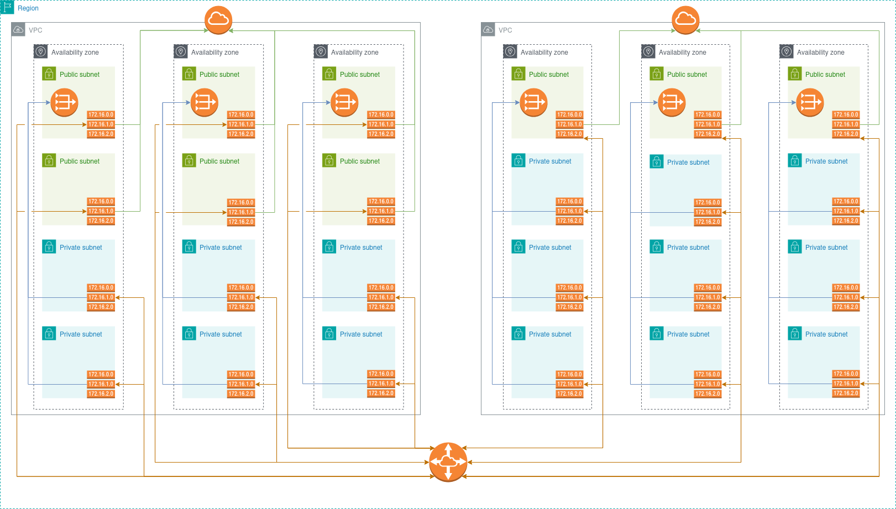

# PeeredVpcNetwork

The `PeeredVpcNetwork` composition builds an n-dimensional VPC network with
peering connections where requested.

The composition creates a VPC network in a single region, with subnets split
into `SubnetSets` where each `SubnetSet` contains *n* subnets, route tables and
route table associations spread across *n* availability zones.

> [!IMPORTANT]
> The created VPC will have the same name as the claim that creates it,
> therefore it is important to properly consider how you will name your
> resources prior to applying the claim as claims are namespace scoped and may
> conflict with the names of other applications in the cluster.

By default, this VPC will be created without any security groups or security
group rules and the outbound (egress) rule is removed from the default VPC
security group.

It is up to the applications deployed into the VPC to define any security groups
and security group rules they require.

## Providers and functions

This composition relies on the following providers and functions:

### Providers

- [`upbound/provider-aws-ec2`] Used to provision VPC level resources

### Functions

- [`function-auto-ready`] A Crossplane Contrib composition function that waits
  for resources to become ready then updates the READY state of the XR.
- [`function-cidr`]. Martin Proffitts fork of `upbound/function-cidr`, a
  composition function that calculates CIDR blocks for a given network size and
  number of subnets. The extended version allows the provision of slicing
  any number of CIDR blocks into smaller blocks by specifying the mask to use.
- [`function-kcl`] The main [`KCL`] language function that provides the core
  functionality for the composition.
- [`function-network-discovery`]. A GiantSwarm composition function that discovers
  network topology for one or more VPCs specified by name.
- [`function-patch-and-transform`] A Crossplane Contrib composition function that
  patches and transforms resources.

## Configuration parameters

> For a full set of configuration options, see the api documentation at
> [apidocs/peeredvpcnetworks.xnetworks.crossplane.giantswarm.io](../../../apidocs/peeredvpcnetworks.xnetworks.crossplane.giantswarm.io.md)

The following parameters are defined specifically for creating a Peered VPC

- `availabilityZones` A list of single character availability zone identifiers,
  for example `["a", "b", "c"]`

- `subnetsets` \[**required**\] Defines how to create the subnet sets required
  as part of this composition

  - `cidr` \[**required**\] A list of VPC Cidr blocks to use for the VPC.

    Each VPC Cidr may be split into *n* public and *n* private subnets as long
    as there is enough room on the cidr for it to be split at that level. Any
    overflow will cause the composition to fail and this will be reflected in
    the status of the XR.

    > [!IMPORTANT]
    > There must be at least 1 entry in this set which will be used as the VPC
    > default CIDR range, and you may define a maximum of 4 additional entries.

    Each entry in the list accepts the following configuration parameters:

    - `prefix` This is the CIDR range to use for the whole VPC.

    - `public` Details on how to build the public subnets.
      - `clusterNames` \[*optional*\] A list of cluster names that may add
        load balancers in the tagged subnet set. Each entry will result in the
        tag `kubernetes.io/cluster/$CLUSTER_NAME    shared` being added to the
        subnets in this set.

        See `lbSetIndex` for deciding which subnetset gets these tags.

      - `count` \[**required**\] The number of public subnets to build. To
        prevent building any public subnets, set this value to `0`.

        Whilst this field is not `immutable`, care should be taken to never
        decrease its value once set as this will result in the destruction of
        subnet sets.

        > [!NOTE]
        > Setting this value to `0` on the first entry in the list (the VPC
        > default CIDR) may result in a fully private VPC with no routes to the
        > outside world and no NAT gateways being created.

      - `lbSetIndex` \[*optional*\] Identifies which subnet set to use for
        public EKS load balancers. Subnets in this set will recieve the
        `kubernetes.io/role/elb: 1` tag.
      - `mask` \[**required**\] This should be a valid CIDR or CIDR suffix
        (including the prefix `/`) to use as a mask for the subnet.

        To prevent subnets being destroyed and recreated *This field is immutable*
      - `offset` \[*optional*\] The number of bits to offset public subnet CIDRs
        by.

    - `private` Details on how to build the private subnets
      - `clusterNames` \[*optional*\] A list of cluster names that may add load
        balancers in the tagged subnet set. Each entry will result in the tag
        `kubernetes.io/cluster/$CLUSTER_NAME    shared` being added to the
        subnets in this set.

        See `lbSetIndex` for deciding which subnetset gets these tags.

      - `count` The number of private subnets to build. To prevent building any
        private subnets, set this value to `0`

        Whilst this field is not `immutable`, care should be taken to never
        decrease its value once set as this will result in the destruction of
        subnet sets.

      - `lbSetIndex` \[*optional*\] Identifies which subnet set to use for
        private EKS load balancers. Subnets in this set will recieve the
        `kubernetes.io/role/internal-elb: 1` tag.

      - `mask` \[**required**\] This should be a valid CIDR or CIDR suffix
        (including the prefix `/`) to use as a mask for the subnet.

        To prevent subnets being destroyed and recreated *This field is immutable*
      - `offset` \[*optional*\] The number of bits to offset public subnet CIDRs by.

  - `function` \[*optional*\] Defines the [`function-cidr`] sub function used to
    create the subnet CIDR ranges for the composition.

    This field accepts only 1 value `multiprefixloop` which is also the default
    value. As a result, it is safe to completely omit this field.

- `region` \[**required**\] The name of the region in which to create the VPC

- `peering` \[*optional*\] Details about peering connections that need to be
  created

  - `allowPublic` \[*optional*\] Allow peering connections from the public
    subnets in the local vpc. Default `true`. Disabling this value will result
    in private only peering.

  - `enabled` Whether to enable or disable peering default: `true`

  - `groupBy` \[*optional\] Denotes the tag to use for grouping the remote VPC
    subnets into sets. If defined, the value of this tag should be an integer.

    If not defined, subnets will be presented as a single flat list. See `status`
    below for details.

  - `remoteVpcs` \[*optional*\] A list of remote VPCs to create peering
    connections to

    - `allowPublic` \[*optional*\] If true, will set up routes to the public
      subnets in addition to private subnets. Default `true`

    - `excludeFromLocalPeering` \[*optional*\] Defines subnet sets (public and
      private) that should be excluded from the peering connection to this
      remote VPC.

      Subnet sets defined here will not receive routes to the peering connection.

      > [!IMPORTANT]
      > This setting requires that the remote VPC subnets are grouped
      > accordingly using the subnet set tag defined under `groupBy` above.

      - `public` Public subnet set indexes to exclude.
      - `private` Private subnet set indexes to exclude.

    - `name` \[**required**\] The name of the VPC to peer with.

    - `providerConfigRef` \[*optional*\] The name of the `ProviderConfig` to use
      for setting up the peering connection - defaults to the claim provider
      config. May be used to discover VPCs for cross account peering.

    - `region` \[*optional*\] The region the remote VPC is located in. If not
      defined, will use the composition region.

    - `excludeFromRemotePeering` \[*optional*\] Defines subnet sets (public and
      private) in the remote VPC that should be excluded from the remote peering.

      Subnet sets defined here will not receive routes to the peering connection.

      > [!IMPORTANT]
      > This setting requires that the remote VPC subnets are grouped
      > accordingly using the subnet set tag defined under `groupBy` above.

      - `public` Public subnet set indexes to exclude.
      - `private` Private subnet set indexes to exclude.

- `tags` Tags to apply to resources in the VPC
  - `common` These are tags that should be applied to all resources
  - `subnets` Specific tags to add to the subnets

## Status

The following details appear on the status of the PeeredVpcNetwork XR:

- `calculatedCidrs` A map of CIDR blocks calculated from the VPC Cidr.
  The map is indexed by VPC Cidr.

- `subnetBits` A set of subnet bits to create. This is handed off to
  [`function-cidr`]
- `vpcs` A map of VPCs connected to this VPC. Each entry follows the convention
  defined under [`function-network-discovery`]. Please see the documentation
  on that function for details.

  A special entry of `self` follows the same convention.

## Examples

The following examples are provided as part of this composition.

> [!TIP]
> Each of these examples is also tested with [`localstack`] which is used
> heavily during development of these compositions by the author.

These require the PeeredVpcNetwork composition be installed to your cluster.
If you have not already done so, follow the instructions on installing the
composition and all its pre-requisites.

### 1. Basic, No Peering

#### [examples/basic-no-peering](../examples/basic-no-peering.yaml)

This claim will create a basic VPC network in the `eu-central-1` region with a
single default cidr prefix of `10.18.0.0/24` consisting of 2 public subnet sets
with mask `/28` and 2 private subnet sets also on mask `/28` across 3
availability zones.

### 2. Basic, Peered

#### [examples/basic-peered](../examples/basic-peered.yaml)

> [!NOTE]
> This example requires that the `basic-no-peering` claim has already been applied
to your account.

This claim will create a second VPC with peering across to the `basic-no-peering`
VPC created as part of example 1.

Like the example above, this VPC will be split across 3 availability zones

- 1 public subnet set with a `/27`
- 3 private subnet sets (9 subnets), each on `/28`

Peering will be initiated to the basic-no-peering VPC on both public and private
subnets.

### 3. Complex Peered

#### [examples/complex-peered](../examples/complex-peered.yaml)

## Definition

The definition can be found at [peeredvpcnetwork_types.go](../v1alpha1/peeredvpcnetwork_types.go)

For a YAML version of this file that can be applied to a cluster, see
[peeredvpcnetworks.yaml](../package/xrds/xnetworks.crossplane.giantswarm.io_peeredvpcnetworks.yaml)

## Composition

The `go` code version of the composition can be found at
[../compositions/peeredvpc](../compositions/peeredvpc)

The composition is made up of 7 segments:

- **Network discovery**. Find information about any VPCs requested for peering.
- **Subnet bits** - KCL language script to calculate subnet bits from CIDR masks.
  Uses [subnets.k](../compositions/peeredvpc/templates/subnets.k)
- **CIDR splitting** using [`function-cidr`]
- **Create Resources**. A KCL script to create complex and repetitive resources.
  Uses [resources.k](../compositions/peeredvpc/templates/resources.k)
- **Dynamic Patching** with KCL for patches that cannot be done with
  [function-patch-and-transform].
  Uses [patching.k](../compositions/peeredvpc/templates/patching.k)
- **Static resource creation** and patching with `function-patch-and-transform`
  For single resources that contain minimal or no complexity.
- **Auto ready**: Mark the XR as ready once all resources are ready.

SubnetSets are created using the [SubnetSet] composition

For a YAML version of the composition that can be applied to the cluster see
[peered-vpc-network.yaml](../package/compositions/peered-vpc-network.yaml)

[`upbound/provider-aws-ec2`]: https://marketplace.upbound.io/providers/upbound/provider-aws-ec2
[`function-network-discovery`]: https://github.com/giantswarm/crossplane-fn-network-discovery
[`function-cidr`]: https://github.com/mproffitt/function-cidr/
[`function-kcl`]: https://github.com/crossplane-contrib/function-kcl
[`function-patch-and-transform`]: https://github.com/crossplane-contrib/function-patch-and-transform
[`function-auto-ready`]: https://github.com/crossplane-contrib/function-auto-ready
[`KCL`]: https://www.kcl-lang.io/
[SubnetSet]: ./subnetset.md
[`localstack`]: https://www.localstack.cloud/
