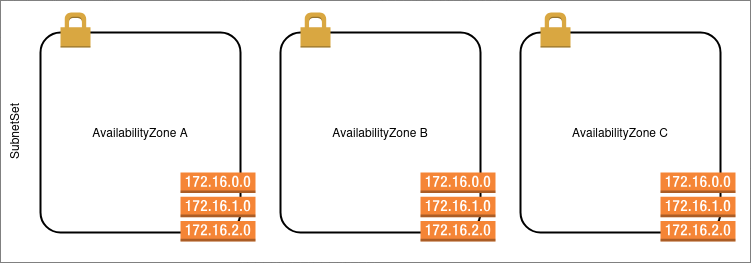

# SubnetSet

> [!NOTE]
> This composition is not meant to be used directly but is used as part of the
> [peeredvpc](./peeredvpc.md) composition.

The purpose of this composition is to create a subnet, route table and route
table associations for each availability zone requested.

The composition does not manage routes which are instead handled by the VPC
composition.

## Providers and functions

This composition relies on the following providers and functions:

### Providers

- [`upbound/provider-aws-ec2`] Used to provision VPC level resources

### Functions

- [`crossplane-contrib/function-auto-ready`] Used to mark the XR as ready once
  all resources are ready.
- [`crossplane-contrib/function-kcl`] Used to dynamically provision managed
  resources

## Configuration parameters

> For a full set of configuration options, see the api documentation at
> [apidocs/subnetsets.xnetworks.crossplane.giantswarm.io](../../../apidocs/subnetsets.xnetworks.crossplane.giantswarm.io.md)

The following parameters are defined specifically for controlling the subnet set

- `appIndex` \[*optional*\] A unique index for the subnetset. When used from the
  VPC subnet this is formed from the start and end cidr blocks provided for each
  subnet in the set. For example if availability zone A had CIDR `10.20.102.0/24`
  and availability zone C had `10.20.104.0/24` then `appIndex` would be
  `10-20-102-0-104-0`.

  The default value for this is an empty string.

- `region` \[**required**\] is the region to build the subnetset in. *This field
  is immutable*.

- `subnets` \[**required**\] A map of availability zones to CIDR blocks. The map
  key should be a single character representing the availability zone to use;
  this will be prefixed with the region automatically. The value must be a valid
  CIDR range, e.g. `10.0.0.0/20`

- `tags` Denotes tags to apply to resources inside the set. These are grouped
  into two catagories:

  - `all` These tags apply to all resources
  - `subnet` These tags are applied to just the subnet resources
  The combined total of all tags must not exceed 50 tags as this is the largest
  number that may be applied to AWS resources.

- `type` \[*optional*\] default public. Denote whether or not subnets in this
  set are public or private. A public subnet is determined by the existence of
  a route to the internet gateway.

- `vpcId` \[**required**\] The VPC Id in which to build the resources. *This
  field is immutable*.

In addition to the above, the following properties are defined by crossplane
system.

- `deletionPolicy`
- `managementPolicies`
- `providerConfigRef`
- `publishConnectionDetailsTo`
- `writeConnectionSecretToRef`

## Status Parameters

The following parameters are exposed via the status of the XR:

- `subnets` A map of `availabilityZone` to `subnetId` of the subnets in the set.

- `routeTables` A map of `availabilityZone` to `routeTableId` of route tables in
  the set.

- `vpcId` The VPC this subnet set is built in.

## Examples

For examples on how to use this composition, please refer to
[PeeredVpcNetwork > Examples](./peeredvpc.md#examples)

[`upbound/provider-aws-ec2`]: https://marketplace.upbound.io/providers/upbound/provider-aws-ec2
[`crossplane-contrib/function-auto-ready`]: https://marketplace.upbound.io/functions/crossplane-contrib/function-auto-ready
[`crossplane-contrib/function-kcl`]: https://marketplace.upbound.io/functions/crossplane-contrib/function-kcl
